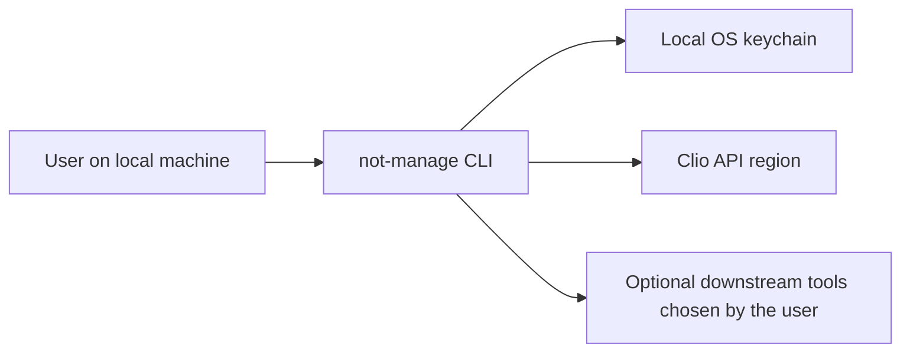

# MVSP Self-Assessment

Product: `not-manage`

Assessment date: 2026-03-13

MVSP release reviewed: latest stable release at `https://www.mvsp.dev/mvsp.en/` as accessed on 2026-03-13

## Product classification

`not-manage` is a local-only command-line tool distributed through npm and GitHub.

- Not Operations does not operate a hosted application server or database for the normal runtime path of this CLI.
- Clio API traffic goes directly from the user's machine to the Clio region the user selected.
- OAuth credentials and tokens are stored in the local OS keychain.
- Command output is rendered locally in the user's terminal and can contain sensitive data.

## Architecture summary

## Sensitive data types in scope

- Clio OAuth access and refresh tokens
- Clio app credentials entered by the user
- Contact, matter, billing, task, activity, and user data returned by Clio
- Terminal output and JSON exports generated locally by the user

## Control matrix

Status meanings used here:

- `Met`: implemented for the product's actual architecture
- `Partial`: implemented in part, but additional work or process evidence is still needed
- `Limited applicability`: the control is primarily designed for hosted services and only applies in a narrowed way here
- `Not currently claimed`: no public claim is made that the control is currently satisfied

| Control | Status | Notes |
| --- | --- | --- |
| `1.1 External vulnerability reports` | `Partial` | Public reporting and remediation policy exists in `SECURITY.md`, including scope and safe-harbor language. Publishing `security.txt` on `notoperations.com` is still pending. |
| `1.2 Customer testing` | `Met` | Customers can test the CLI on their own systems and against developer-controlled Clio apps or test data, with reasonable restrictions documented in `CUSTOMER-TESTING.md`. |
| `1.3 Self-assessment` | `Met` | This document is the annual self-assessment for `not-manage`. |
| `1.4 External testing` | `Not currently claimed` | No public claim is made that an annual independent penetration test has been completed for this product. |
| `1.5 Training` | `Not currently claimed` | No public claim is made here about role-specific security training records for maintainers. |
| `1.6 Compliance` | `Partial` | Public legal, privacy, security, and data-handling docs exist. No SOC 2, ISO 27001, PCI DSS, or similar certification is currently claimed. |
| `1.7 Incident handling` | `Partial` | Incident response and a 72-hour notification commitment are documented, but most sensitive product data remains on customer-controlled systems. |
| `1.8 Data handling` | `Limited applicability` | Not Operations does not operate a hosted datastore for normal runtime. Sanitization obligations mainly apply to maintainer-controlled support artifacts and any unencrypted local copies created during support. |
| `2.1 Single Sign-On` | `Limited applicability` | `not-manage` does not operate a Not Operations account system for end users. Authentication is delegated to the user's Clio app and Clio OAuth flow. |
| `2.2 HTTPS-only` | `Met` | Network calls to Clio use HTTPS. The only HTTP exception is the local loopback OAuth callback, which is restricted to `127.0.0.1`, `localhost`, or `::1` and is not internet-exposed. |
| `2.3 Security headers` | `Partial` | The public website has baseline security headers, but the CLI itself is not a browser-hosted application and this control applies only to supporting web surfaces. |
| `2.4 Password policy` | `Limited applicability` | `not-manage` does not manage end-user passwords. |
| `2.5 Security libraries` | `Met` | The CLI uses maintained platform features and libraries appropriate to a Node.js CLI, including the OS keychain integration. |
| `2.6 Dependency patching` | `Met` | Dependabot, CI, npm audit, CodeQL, Semgrep, and dependency review are configured in the repository. |
| `2.7 Logging` | `Partial` | There is no hosted application log service for customer runtime events. Local command output remains user-controlled and may contain sensitive data, so the product emphasizes warning and minimization instead of central log retention. |
| `2.8 Encryption` | `Met` | Sensitive data is protected in transit to Clio with HTTPS, and stored credentials/tokens are kept in the local OS keychain rather than plaintext config files. |
| `3.1 List of data` | `Met` | The expected sensitive data types are listed in this assessment and in the repository's privacy/data-handling docs. |
| `3.2 Data flow diagram` | `Met` | The architecture diagram above documents how sensitive data reaches the CLI and where it is stored. |
| `3.3 Vulnerability prevention` | `Partial` | The codebase includes secure handling for loopback redirects, OAuth state, host validation, keychain storage, and redaction warnings. A more formal maintainer secure-development standard could strengthen this further. |
| `3.4 Time to fix vulnerabilities` | `Met` | `SECURITY.md` defines remediation targets for high, medium, and low severity issues. |
| `3.5 Build and release process` | `Met` | Releases are built from version-controlled source in GitHub Actions and published to npm with provenance. Secrets are not stored in the public repository. |
| `4.1 Physical access` | `Limited applicability` | Not Operations does not run physical infrastructure for the normal runtime data path of this CLI. Supporting providers are responsible for their facilities. |
| `4.2 Logical access` | `Partial` | In normal runtime, Not Operations does not have routine access to customer Clio data. Any maintainer access to support artifacts should remain minimal and need-based. |
| `4.3 Sub-processors` | `Partial` | `SUBPROCESSORS.md` documents service providers and the fact that no hosted runtime subprocessor is in the normal Clio data path. Annual provider review is a process commitment rather than a public attestation. |
| `4.4 Backup and Disaster recovery` | `Partial` | The product has no hosted customer datastore. Repository, package, and documentation continuity are documented, but no public claim is made that annual DR exercises have been completed. |

## Open items

These items remain the most important gaps if the goal is Clio App Directory approval with a stronger MVSP story:

1. Publish `security.txt` at `https://notoperations.com/.well-known/security.txt`.
2. Add direct legal, privacy, security, support, and self-assessment links on `https://notoperations.com/not-manage-cli`.
3. Complete and retain evidence for an annual third-party penetration test.
4. Complete and retain evidence for role-specific security training.
5. Retain internal evidence of annual subprocessor review and backup/DR review.

## Related public documents

- `README.md`
- `SECURITY.md`
- `PRIVACY.md`
- `DATA-HANDLING.md`
- `OPERATIONS.md`
- `CUSTOMER-TESTING.md`
- `SUBPROCESSORS.md`
- `SUPPORT.md`
